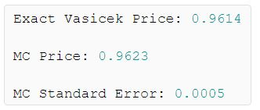

```{r setup, include=FALSE}
knitr::opts_chunk$set(echo = FALSE)
```

# Introducción

## Objetivo

El objetivo de este trabajo es explicar el contexto general y la razón de existir del Modelo de Vasicek, así como mostrar sus resultados teóricos más importantes. Explorar la información obtenida con diversas fuentes de información, comparar y ver su comportamiento basados en una implementación computacional. 

Los temas más importantes a revisar, los podrán observar en la barra al costado izquierdo de este documento.

## Antecedentes

### Antecedentes (Black-Scholes)

Para poder hablar del **modelo de Vasicek**, debemos saber cuál es el objetivo y de dónde surge esta metodología. Con esta finalidad, recordemos primeramente uno de los resultados más importantes que tenemos en los productos financieros derivados.

\begin{color_block}{violet}{Ecuación de Black-Scholes}

$$
\derivada{V}{t} + \frac{1}{2} \sigma^2 S^2 \derivada{^2 V}{S^2} + rS \derivada{V}{S} - rV = 0
$$

\end{color_block}

Recordemos que esta ecuación nos puede servir para valuar un producto financiero **derivado de un bien subyacente** $\mathbf{S}$. Esto significa que nos basamos en el comportamiento de $S$ y apoyados de lema de Itô se logra realizar una valuación **neutral al riesgo** del derivado.

### Antecedentes (Bono)

Pongámonos en contexto con un contrato financiero muy importante.

\vspace{0.4cm}

\begin{color_block}{brown}{Bono \href{https://www.youtube.com/watch?v=IuyejHOGCro}{(Ver video)}}

A grandes rasgos, un \textbf{Bono} es un contrato financiero que respecta a un préstamo. En este contrato participan dos partes, el prestamista y el prestatario. Existen diversos tipos de bonos, pero en los más esenciales se consiste en dar un préstamo a tiempo $t=0$ el cual se liquidará en un tiempo de maduración $t=T$, todo esto con ciertos intereses. \\

\vspace{0.5cm}

Cuando en tiempos tales que $t\in(0,T)$, el prestatario paga un porcentaje \href{https://www.cuidatudinero.com/13075374/como-calcular-la-tasa-de-cupon-de-los-bonos}{(tasa cupón)} del préstamo total al prestamista (\textit{Valor Facial/Nominal}), se dice que ese bono está cuponado o simplemente se le llama "bono"{} pero cuando esto no sucede y únicamente se paga el préstamo en el tiempo de maduración a la tasa de interés establecida, entonces se le llama "bono cupón-cero".

\end{color_block}

Estos contratos se dice tienen "problemas técnicos" pues valuarlos resulta más complicado **al no existir un bien subyacente** ($\mathbf{S}$) del cual apoyarse.

### Antecedentes (Valuación de un Bono)

<!-- Esto puede servir para justificar el texto de la ventana actual. -->
<!-- \justifying -->

Ahora veamos el siguiente resultado.

\begin{color_block}{blue}{Ecuación para valuar un Bono.}

$$
\derivada{V}{t} + \frac{1}{2} w^2 \derivada{^2 V}{r^2} + (u-\lambda w) \derivada{V}{r} - rV = 0
$$

\end{color_block}

\vspace{-0.3cm}

Donde

- $r$ es una tasa de interés.

- $u$ es la \href{https://www.investopedia.com/terms/s/spot_rate.asp}{tasa spot} real.

- $T$ es el tiempo de maduración del Bono.

- $t$ es un tiempo tal que está en el intervalo $[0,T]$.

- $V := V(r,t;T)$ es el precio del bono a tiempo $t$ y tasa $r$.

- $u - \lambda w$ y $w$ funciones que dependen de $r$ y $t$.

De esta ecuación, el primer término se interpreta como el "tiempo de decaimiento", el segundo como "difusión", el tercero como "deriva" (*drift*) y el cuarto como "descuento".


### Antecedentes (Nociones teóricas)

La solución de la ecuación para la valuación de un bono se puede interpretar como el **valor presente esperado** de todos los flujos de efectivo. Por ejemplo, suponiendo que hay un *payoff* y sabiendo que las tasas de interés también *pueden ser aleatorias* entonces el valor de un contrato en tiempo $t$ sería.

$$
\mathbb{E}\left[e^{-\int_t^T r(\tau)d\tau}Payoff\right]
$$

Así como en las opciones que ya hemos trabajado, esta esperanza no se calcula con respecto de la *variable aleatoria real*, sino con respecto a una **variable neutral al riesgo**. La diferencia está en que en el término del *drift* no se hace con respecto a la tasa spot real, sino con respecto a la llamada **tasa spot neutral al riesgo** esta es $u-\lambda w$. De tal manera que se modelará el valor del instrumento financiero usando una tasa neutral al riesgo. Esta tasa satisface

\vspace{-0.1cm}

$$
\partial r = (u-\lambda w)\partial t + w \partial X
$$

Donde $X$, que modela el precio del riesgo de mercado, será incluida pues $r$ no se negocia.

# El Modelo

### ¿Qué es y cuál es el objetivo del modelo?

El Modelo de Vasicek fue introducido por  Oldřich Vašíček en 1997\footnote{\href{https://en.wikipedia.org/wiki/Vasicek_model}{Wikipedia - Vasicek model}}
 y lo que busca es encontrar una **tasa spot** $r_t$ neutral al riesgo basándose en la valuación de Bonos y más en particular en la dinámica que estos tienen con base en la siguiente ecuación diferencial estocástica\footnotemark{}. 

\begin{color_block}{olive}{Modelo de Vasicek}

$$
\partial r_t = (a-br_t)\partial t + \sigma dW_t
$$

Donde $a$, $b$ y $\sigma$ son constantes estrictamente positivas y $W_t$ es un movimiento Browniano estándar bajo la medida martingala spot. 

\end{color_block}

Se sabe que los Bonos cuponados se pueden descomponer en Bonos cupón cero, de tal manera que el modelo se centra principalmente en este tipo de instrumentos financieros para posteriormente realizar una generalización. Para efectos de esta presentación, nos centraremos en mostrar resultados y estudiar el caso para Bonos no cuponados.


\footnotetext{Existen más parametrizaciones del modelo, por ejemplo $\partial r_t = \kappa (\theta-r_t)\partial t + \beta dW_t$.}


### ¿Qué representan los parámetros?

De la ecuación diferencial estocástica planteada por Vasicek

- $a/b$ representa el \textbf{valor medio a largo plazo}

- $b$ representa la \textbf{velocidad de reversión}, esto es, qué tan rápido se \textit{reagrupan} alrededor de $a/b$.

- $\sigma$ representa la \textbf{volatilidad instantánea}, mide la amplitud de la aleatoriedad de entrada al sistema. 

- $\sigma^2/(2b)$ representa la \textbf{varianza a largo plazo}, con esta varianza se \textit{reagrupan} alrededor de $a/b$.

## Proposiciones (Para la tasa spot)


\begin{color_block}{violet}{1. Solución para $r_t$.}

La solución a la ecuación diferencial estocástica planteada por Vasicek está dada por

\vspace{-0.1cm}

$$
r_t = r_s e^{-b(t-s)} + \frac{a}{b} \left(1-e^{-b(t-s)}\right) + \sigma \int_s^t e^{-b(t-u)} dW_u .
$$

Para cualquier $s<t$ la distribución condicional de $r_t$ con respecto al $\sigma$-álgebra $\mathcal{F}_s$ es Gaussiana, con esperanza condicional basada en la medida martingala neutral al riesgo $\mathbb{P}$

\vspace{-0.1cm}

$$
\mathbb{E}_\mathbb{P}\left[r_t|\mathcal{F}_s\right] = r_s e^{-b(t-s)} + \frac{a}{b} \left(1-e^{-b(t-s)}\right)
$$

y varianza condicional

\vspace{-0.1cm}

$$
Var_\mathbb{P}\left(r_t|\mathcal{F}_s\right) = \frac{\sigma^2}{2b}\left(1-e^{-2b(t-s)}\right)
$$

\end{color_block}

\vspace{-0.1cm}

\begin{color_proof}{red}{Demostración}

La prueba de esta proposición se encuentra en el libro \href{https://tinyurl.com/ycsmhcer}{Martingale Methods in Financial Modelling - Marek Musiela \& Marek Rutkowski - Lemma 10.1.2}.

\end{color_proof}

### Proposiciones (Para la tasa spot)

Derivado de los resultados anteriores, no es muy complicado notar que 

$$
\underset{t\rightarrow\infty}{lim} \mathbb{E}_\mathbb{P}\left[r_t|\mathcal{F}_s\right] = \frac{a}{b}
$$

y también

$$
\underset{t\rightarrow\infty}{lim} Var_\mathbb{P}\left(r_t|\mathcal{F}_s\right) = \frac{\sigma^2}{2b}
$$

Que nos permite ver el porqué de la interpretación de los parámetros.

### Proposiciones (Para el valor del Bono)

\begin{color_block}{blue}{2. Solución para la valuación de un Bono cupón cero.}

El precio a tiempo $t$ un Bono cupón cero con (con valor facial igual a 1) bajo el modelo de Vasicek es

$$
B(t,T) = e^{m(t,T) - n(t,T)r_t} 
$$

Donde

\begin{itemize}

\item  $\displaystyle n(t,T) = \frac{1}{b} \left(1-e^{-b(T-t)}\right)$

\item  $\displaystyle m(t,T) = \frac{\sigma^2}{2} \int_t^T n^2(u,T)du -a\int_t^T n(u,T)du$

\end{itemize}

\vspace{0.1cm}

Más aún, la función de volatilidad de un bono es $b(\cdot,T):[0,T]\rightarrow\mathbb{R}$, en específico, $b(t,T)=\sigma n(t,T)$ y así, la dinámica del precio del bono bajo $\mathbb{P}$ es

$$
\partial B(t,T) = B(t,T)(r_t \partial t - \sigma n(t,T) \partial W_t)
$$

\end{color_block}

\vspace{-0.15cm}

\begin{color_proof}{cyan}{Demostración}

La prueba de esta proposición se encuentra en el libro \href{https://tinyurl.com/ycsmhcer}{Martingale Methods in Financial Modelling - Marek Musiela \& Marek Rutkowski - Proposition 10.1.2 y Proposition 10.1.3}

\end{color_proof}

## Implementación 

### Implementación (Lee)

Una vez conocidos los resultados, procedemos a conocer cómo funcionan y principalmente a ver si podemos diversificar las fuentes de información y homologar la teoría desarrollada en las fuentes citadas. Para esto, consideraremos un ejemplo realizado por un autor llamado \href{https://www.r-bloggers.com/author/lee/}{Lee}, el cual nos presenta una implementación en código R del modelo de Vasicek en su artículo \href{https://www.r-bloggers.com/2010/04/fun-with-the-vasicek-interest-rate-model/}{"Fun with the Vasicek Interest Rate Model"}\footnote{En su artículo, Lee está usando una parametrización alternativa del modelo de Vasicek, bajo nuestra notación, tenemos que $a=\kappa\theta$, $b=\kappa$, $\sigma=\beta$.}.

Tomaremos un ejemplo muy particular el cual es para la valuación de un Bono\footnote{Tomamos este ejemplo pues la implementación de la valuación del Bono trae intrínsecamente la de la tasa spot.}, aquí, el autor se toma los parámetros como $T = 1$, $a = (0.1)(0.3)$, $b = 0.3$, $\sigma = 0.03$, $s = 0$ y $r_s = 0.03$. De aquí, se obtienen los siguientes resultados

```{r,out.width='50%',fig.align='center'}

```

### Implementación (Edgar)

Ahora bien, nosotros **NO** usaremos la implementación realizada por \href{https://www.r-bloggers.com/author/lee/}{Lee}, pues de hecho él tiene fórmulas tanto con otras parametrizaciones como un poco más desarrolladas en algunos puntos. Sin embargo hicimos **nuestra implementación**\footnotemark{} del cálculo exacto de la valuación del Bono, basados en los resultados expuestos en este trabajo.  

```{r}
# Valuación del Bono ------------------------------------------------------

# Tenemos un ejemplo aquí de la valuación de un Bono con Vasicek

# https://www.r-bloggers.com/2010/04/fun-with-the-vasicek-interest-rate-model/

n <- function(t, tf, b) {
  1 / b * (1 - exp(-b * (tf - t)))
}

n2 <- function(t, tf, b) {
  (1 / b * (1 - exp(-b * (tf - t)))) ^ 2
}


m <- function(t, tf, sigma, a, b) {
  
  int1 = integrate(
    n2,
    lower = t,
    upper = tf,
    tf = tf,
    b = b
  )$value
  
  int2 = integrate(
    n,
    lower = t,
    upper = tf,
    tf = tf,
    b = b
  )$value
  sigma ^ 2 / 2 * int1 - a * int2
  
}

Bono <- function(t,tf,a,b,sigma,s = 0,rs = 0.05) {
  # Función para obtener la esperanza de rt.
  rt <- function(t, s, rs, a, b) {
    rs * exp(-b * (t - s)) + a / b * (1 - exp(-b * (t - s)))
  }
  
  aux <- function(t, tf, a, b, sigma, s, rs) {
    exp(m(t, tf, sigma, a, b) - n(t, tf, b) * rt(t, s, rs, a, b))
  }
  
  sapply(t,aux,tf = tf,a = a,b = b,sigma = sigma,s = s,rs = rs)
  
}
Valor=Bono(t = 0,tf = 1,a = 0.1*0.3,b = 0.3,sigma = 0.03,s = 0,rs = 0.03)
```


La ejecución de nuestra función se ve la siguiente manera

\vspace{0.4cm}

```{r,echo=TRUE,eval=FALSE}
Bono(t = 0, tf = 1, a = 0.1*0.3, b = 0.3,
     sigma = 0.03, s = 0, rs = 0.03)
```

Lo cual nos da como resultado

$$
B(0,1) = `r Valor`
$$

Lo cual coincide con los resultados propuestos por Lee.

\footnotetext{El código lo podrán encontrar dando clic ya sea que gusten ver  el  \href{https://tinyurl.com/y98lwtp8}{\texttt{script.R}} o bien, la \href{https://tinyurl.com/yde89rys}{\texttt{presentación.Rmd}}.}

### Implementación (Shiny)

Una vez que ya hemos verificado con un ejemplo que nuestra implementación es correcta, hemos desarrollado una pequeña aplicación en \href{https://rstudio.com/products/shiny/}{RStudio-Shiny} para poder manipular las funciones creadas con base en la teoría expuesta. Para poder acceder a esta aplicación basta con dar clic sobre la siguiente imágen.

\begin{center}
  \href{https://edgar-alarcon.shinyapps.io/Modelo_Vacisek/?_ga=2.81008535.1011404247.1609457667-842461214.1606672993}{\includegraphics[scale=0.5]{Shiny.png}}\\
  
  \href{https://edgar-alarcon.shinyapps.io/Modelo_Vacisek/?_ga=2.81008535.1011404247.1609457667-842461214.1606672993}{Aplicación en R Shiny.}
\end{center}       

# Epílogo

## ¿Qué es lo que sigue?

En el libro \href{https://tinyurl.com/ycsbky8k}{Paul Wilmott - Paul Wilmott Introduces Quantitative Finance} se habla sobre un modelo de Vasicek extendido. Con el objetivo de calibrar el modelo tradicional, se propone estimar estadísticamente los parámetros $b$ y $\sigma$. Por otro lado, el parámetro $a$ se propone ahora como una función del tiempo $a(t)$, modificación que altera la ecuación diferencial estocástica de la siguiente forma

$$
\partial r_t = (a(t)-br_t)\partial t + \sigma dW_t
$$

Esto eventualmente afectará las relaciones anteriores y también se podrá encontrar una solución explícita para la función $a(t)$.

## Conclusiones

Aún quedan bastantes cosas por hacer con respecto al modelo, al menos en términos aplicados. Se puede explorar la metodología Monte Carlo propuesta por \href{https://www.r-bloggers.com/author/lee/}{Lee} para entender el funcionamiento estocástico de lo realizado. 

A su vez, es importante buscar cómo encontrar una estimación "estadísticamente adecuada" para los parámetros del modelo, en nuestros ejemplos hemos logrado ver el comportamiento teórico del mismo variando sus parámetros. Pero lo ideal sería usar la información estadística disponible para estimar los parámetros que mejor se adecúen al modelo.

En este trabajo hemos logrado verificar computacionalmente el desarrollo teórico del modelo, se hace énfasis final en que una implementación práctica con datos reales será lo idea y un buen paso siguiente a dar antes que explorar el modelo de Vasicek extendido por ejemplo.

# Bibliografía

Podrán ver todas las fuentes de información completas con la que se construyó esta presentación dando clic en los siguientes enlaces.

- \href{https://drive.google.com/file/d/16lkTntZXmnh8Ev1d2kFH3FL8ofVIs2NB/view?usp=sharing}{Etheridge A. - A Course in Financial Calculus}

- \href{https://drive.google.com/file/d/12H5o8Lp3uiJYbJfMKayJylxwxDO3yPBB/view?usp=sharing}{Marek Musiela \& Marek Rutkowski - Martingale Methods in Financial Modelling}

- \href{https://drive.google.com/file/d/1y1jcAM3kJfRdU_uJ82xdeacvkmYdRW4u/view?usp=sharing}{Paul Wilmott - Paul Wilmott Introduces Quantitative Finance}

- \href{https://www.r-bloggers.com/2010/04/fun-with-the-vasicek-interest-rate-model/}{Lee - Fun with the Vasicek Interest Rate Model}

```{r,fig.align='center',out.width='50%'}

```

