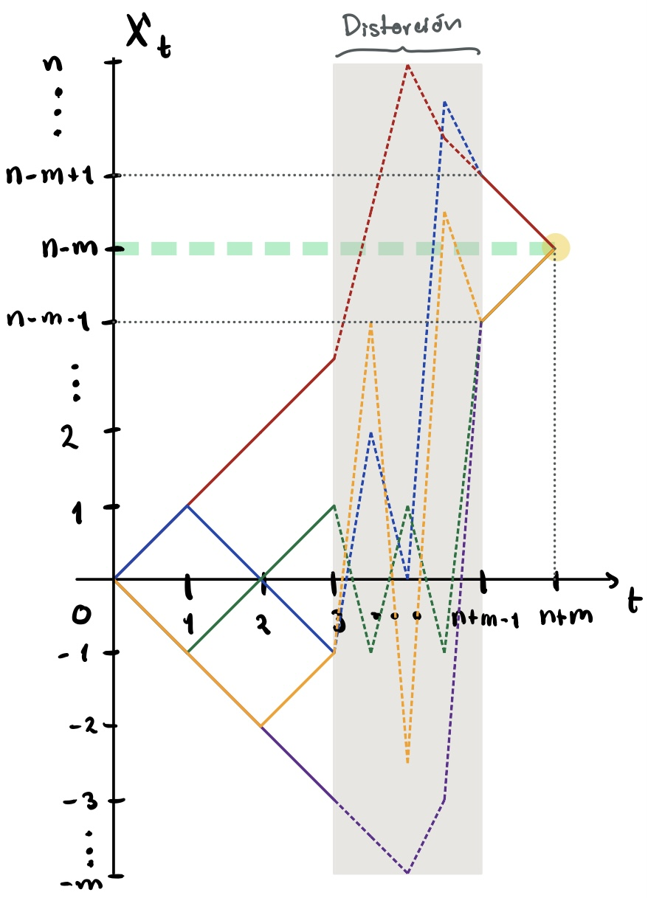
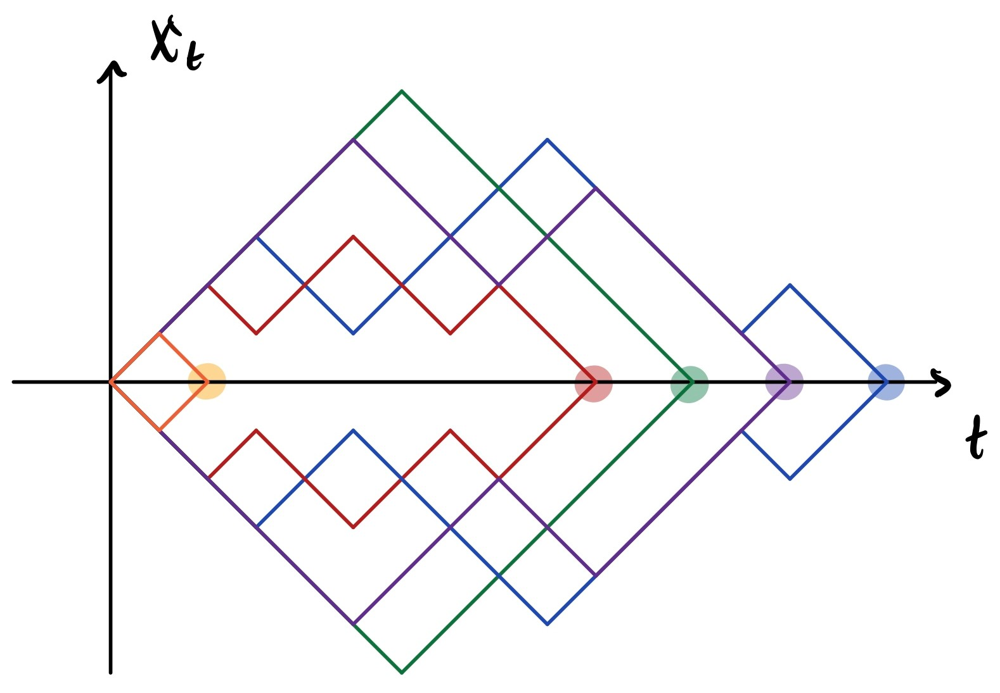

```{r setup, include=FALSE}
knitr::opts_chunk$set(out.width = '75%',fig.align = 'center')
```

El candidato A obtiene $n$ votos y B obtiene $m$ con $n > m$. ¿Cuál es la probabilidad que A siempre vaya en la delantera en los conteos?

\textit{Solución.}

Sea $\{X_t\}_{t=1}^{n+m}$ la ventaja que tiene el candidato $A$ sobre el candidato $B$, en este sentido, $t$ denota el número de votante que ejerce sufragio. Pensamos entonces que $t\geq 0$ y definimos $X_0 \equiv 0$. Hagamos una observación de cómo podrían ser las trayectorias.

```{r,echo=FALSE,out.width='50%',fig.align='center'}

```

El área gris denota una posible trayectoria que hay desde $t>3$ hasta $t<n+m-1$. Notemos que este es un proceso estocástico pensado a tiempo discreto. Hagamos un par de observaciones:

*Observación 1*: Toda trayectoria comienza en cero y termina en $n-m>0$ esto pues tenemos la hipótesis $n>m$.

*Observación 2*: El punto más alto que puede tener la trayectoria es $n$, mientras que el más bajo es $-m$. Esto claro, en caso de que los primeros votantes ejerzan sufragio para el mismo votante consecutivamente.

Derivado de lo anterior, tenemos dos principales consecuencias.

*Consecuencia 1*: Toda ruta en la que exista $t_0$ tal que $X_{t_0}<0$ implica la existencia de un $t_1$ tal que $X_{t_1}\equiv 0$. Esto pues si en algún momento va perdiendo el candidato A, debe haber un momento donde haya un empate ya que sabemos que al final él remontará.

*Consecuencia 2*: Toda ruta que comience con un votante para B, debe tener un $t_1$ tal que $X_{t_1}\equiv 0$. Esto de nuevo, por la consecuencia anterior.

Todo esto nos ayuda a comprender mejor cómo se está comportando la ruta de nuestro proceso. No debemos perder de vista el objetivo del ejercicio, se pueden hacer observaciones igualmente importante como que si $t>2m \Rightarrow X_t >0$, pero con lo anterior podemos hacer frente a lo siguiente.

*Afirmación 3*: "$\exists t$ tal que $X_t\equiv 0$" $\Leftrightarrow$ "$\exists t$ tal que $X_t\leq 0$"

\begin{proof}$\newline$

\vspace{-0.5cm}

La primera implicación $(\Rightarrow)$ es clara, ya que $\leq$ es en particular $=$. La segunda $(\Leftarrow)$ se da gracias a lo establecido en la \textit{Consecuencia 1}.

\end{proof}

*Afirmación 4*: El evento "$X_t > 0$ $\forall t$" (que significa que el candidato A vaya siempre a la delantera) tiene como evento complementario "$\exists t$ tal que $X_t\equiv 0$" (que significa que en algún momento exista un empate).

\begin{proof}$\newline$

\vspace{-0.5cm}

El evento complementario a "$X_t > 0$ $\forall t$" es directamente que "$\exists t$ tal que $X_t\leq 0$" el cual es equivalente a "$\exists t$ tal que $X_t\equiv 0$" gracias a lo establecido en la \textit{afirmación 3}.

\end{proof}

*Afirmación 5*: "$X_1 = -1$ y $\exists t$ tal que $X_t\equiv 0$" $\Leftrightarrow$ "$X_1 = -1$". 

\begin{proof}$\newline$

\vspace{-0.5cm}

Gracias a lo establecido en la \textit{consecuencia 2} tenemos que "$X_1 = -1$" $\Rightarrow$ "$\exists t$ tal que $X_t\equiv 0$". De tal manera que pensando los eventos como conjuntos $\{X_1 = -1\} \subset \{\exists t \hspace{0.25cm} \text{tal que} \hspace{0.25cm} X_t\equiv 0\}$. De tal manera que $\{X_1 = -1\} \cap \{\exists t \hspace{0.25cm} \text{tal que} \hspace{0.25cm} X_t\equiv 0\}=\{X_1 = -1\}$

\end{proof}

*Afirmación 6*: $\mathbb{P}[X_1 = 1 , \exists t \hspace{0.25cm} \text{tal que} \hspace{0.25cm} X_t\equiv 0] = \mathbb{P}[X_1=-1]$

\begin{proof}$\newline$

\vspace{-0.5cm}

Probar esto, debido a la \textit{Afirmación 5} es equivalente a probar:

$$
\mathbb{P}[X_1 = 1 , \exists t \hspace{0.25cm} \text{tal que} \hspace{0.25cm} X_t\equiv 0] = \mathbb{P}[X_1 = -1 , \exists t \hspace{0.25cm} \text{tal que} \hspace{0.25cm} X_t\equiv 0]
$$

Esta probabilidad es equivalente pues toda ruta tal que $X_1 = 1$ y toca el cero, tiene su evento simétrico tal que $X_1 = -1$ y toca el cero; esto pues,  podemos conmutar las votaciones en un orden adecuado para que la probabilidad se mantenga. En otras palabras, no hay camino que comience en $1$ y toque el cero, que no pueda tener un fragmento simétrico dado por uno que empiece en $-1$. Un ejemplo visual de esto lo podemos notar en el siguiente gráfico

```{r,echo=FALSE,out.width='75%',fig.align='center'}

```

\textit{Nota}: Posterior al primer punto en que toca el cero, ambos caminos pueden ser completamente idénticos pues han votado la misma cantidad de personas.

\end{proof}

Habiendo hecho todo lo anterior, podemos comenzar con la prueba del ejercicio principal.


\vspace{-0.5cm}
\begin{align*}
    \mathbb{P}[X_t > 0 \hspace{0.25cm} \forall t\geq 1] &= 1 - \mathbb{P}[\exists t \hspace{0.25cm} \text{tal que} \hspace{0.25cm} X_t \leq 0] \\
      &= 1 - \left( \mathbb{P}[\exists t \hspace{0.25cm} \text{tal que} \hspace{0.25cm} X_t \leq 0,X_1 = -1] + \mathbb{P}[\exists t \hspace{0.25cm} \text{tal que} \hspace{0.25cm} X_t \leq 0,X_1 = 1]  \right) \\
      &= 1 - 2\mathbb{P}[X_1 = -1] \tageq{Af 3, 4 y 5}\\
      &= 1 - 2 \left(\frac{m}{n+m}\right) = \frac{n-m}{n+m}
\end{align*}

$$
\therefore \mathbb{P}[X_t > 0 \hspace{0.25cm} \forall t\geq 1] = \frac{n-m}{n+m}
$$

A continuación mostramos un código que muestra rutas para diferentes valores de $n$ y $m$. Mostraremos únicamente el algoritmo de simulación.

```{r}
Sim_Trayectorias<-function(argumentos){
  
  
  # Votantes para A
  N <- argumentos[1]
  # Votantes para B
  M <- argumentos[2]
  # Número de tiempos (contando el cero)
  n = N+M+1 # EN ESTE CASO, el número de tiempos va ligado con los parámetros N y M.
  
  # Los tiempos van entre 0:(N+M) pues son todos los votantes y el inicio en cero.
  times <- 0:(N+M)
  
  # Algoritmo de simulación
  algoritmo<-function(pasado,t){
    # Veamos el voto.
    voto<-sample(x = c(1,-1),  # Si vota A aumenta, B disminuye.
                 size = 1,      # Emite un voto
                 prob = c(N,M)/(N+M)) # Probabilidad de votar A y B respectivamente.
    # Cuando los votantes disminuyen conforme van pasando. 
    # (Obligamos a que la N y M sean guardadas aún fuera de la función)
    if(voto==1){
      N<<-N-1 # Disminuyen los votantes para A
    }else{
      M<<-M-1 # Disminuyen los votantes para A
    }
    # Movamos la trayectoria
    presente <- pasado + voto
    return(presente)
  }
  
  
  # Simulamos las trayectorias
  xt1<- 0 # Xt1 = X0 = 0
  Xt <- Reduce(f = algoritmo,                 #Aplica este algoritmo.
               x = times[2:n]-times[1:(n-1)], #Usa estos tiempos.
               init = xt1,                    #Aquí partimos.
               accumulate = TRUE)             #Toda la trayectoria.
  
  return(Xt)
  
}

# Realizamos las simulaciones:
argumentos<-list(c(100,10),c(10,1),c(1000,100),c(100,90),c(10,9),c(1000,900))
set.seed(21)
Xts <- sapply(X = argumentos,FUN = Sim_Trayectorias)
```

Adicionalmente vemos los gráficos

```{r,echo=F,message=F,warning=FALSE}
library(ggplot2) ; library(ggpubr) ; library(RTextTools)
library(latex2exp)
plots<-list()
for(i in 1:length(Xts)) {
  df = data.frame(x = 0:(length(Xts[[i]]) - 1), y = Xts[[i]])
  # Gráfico del proceso
  plots[[i]] <- ggplot(df, aes(x = x, y = y)) +
    # Graficamos la línea con estas características
    geom_step(color = "darkblue", lty = 1, lwd = 0.7) +
    # Leyendas de los ejes.
    theme(
      plot.title = element_text(
        color = "violetred",
        size = 12.5,
        face = "bold.italic"
      ),
      axis.title.x = element_text(
        color = "blue",
        size = 11,
        face = "bold"
      ),
      axis.title.y = element_text(
        color = "red",
        size = 11,
        face = "bold"
      )
    ) +
    # Título
    labs(title = TeX(paste0(
      "Proceso con N = ",
      argumentos[[i]][1], " y M = ",
      argumentos[[i]][2]
    )),
    x = expr(t[i]),
    y = expr(X[t[i]])) +
    # Donde termina el proceso
    geom_hline(
      yintercept = argumentos[[i]][1] - argumentos[[i]][2],
      linetype = "dashed",
      color = "red",
      size = 0.25
    ) +
    # Umbral del empate entre los candidatos.
    geom_hline(
      yintercept = 0,
      color = "purple",
      size = 0.25
    )
}

figure <- egg::ggarrange(plots = plots,
                         ncol = 2, nrow = 3)
```

Podemos también observar rutas que tengan el mismo parámetro simplemente cambiando un poco el código y lo hacemos para $n=100$ y $m=50$.

```{r,echo=F,message=F,warning=F}
# Votantes para A
N = 100
# Votantes para B
M = 50
# Número de tiempos (contando el cero)
n = N+M+1 # EN ESTE CASO, el número de tiempos va ligado con los parámetros N y M.

# Los tiempos van entre 0:(N+M) pues son todos los votantes y el inicio en cero.
times <- 0:(N+M)

Sim_Trayectorias<-function(){
  
  # Esta función presupone la existencia de los objetos "n" que indica el número de
  # simulaciones, el vector "times" que indica los tiempos t_i y la cantidad de 
  # votantes de A (N) y votantes por B (M).
  
  # Para regresar a las N a su valor original:
  Naux <- N
  Maux <- M
  
  # Algoritmo de simulación
  algoritmo<-function(pasado,t){
    # Veamos el voto.
    voto<-sample(x = c(1,-1),  # Si vota A aumenta, B disminuye.
                 size = 1,      # Emite un voto
                 prob = c(N,M)/(N+M)) # Probabilidad de votar A y B respectivamente.
    # Cuando los votantes disminuyen conforme van pasando.
    if(voto==1){
      N<<-N-1
    }else{
      M<<-M-1
    }
    # Movamos la trayectoria
    presente <- pasado + voto
    return(presente)
  }
  
  
  # Simulamos las trayectorias
  xt1<- 0 # Xt1 = X0 = 0
  Xt <- Reduce(f = algoritmo,                 #Aplica este algoritmo.
               x = times[2:n]-times[1:(n-1)], #Usa estos tiempos.
               init = xt1,                    #Aquí partimos.
               accumulate = TRUE)             #Toda la trayectoria.
  
  # Terminando esto, regresamos a la normalidad a N y a M
  N <<- Naux
  M <<- Maux
  
  return(Xt)
  
}

# Realizamos las simulaciones:
num_trayec = 7 # Voy a pedir que sea par para hacer gráficos después.
num_trayec <- ifelse(num_trayec%%2==0,num_trayec,num_trayec-1)
set.seed(21)
Xts <- replicate(n = num_trayec,expr = Sim_Trayectorias())
#dim(Xts)

# Y ahora veamos todos juntos ---------------------------------------------

library(reshape2)
#View(Xts)

# Ajustamos algunos nombres
dat<-data.frame(times,Xts)
names(dat)<-c("tiempos",1:num_trayec)
dat.m<-melt(dat,           # Con estos datos
            id.vars = "tiempos",# Y usando de referencia
            measure.vars = names(dat)[-1])
names(dat.m)[2]="Trayectoria"

# Gráfico
ggplot(dat.m,aes(tiempos,value,colour=Trayectoria)) +
  geom_step(lwd=0.75) +
  scale_colour_manual(values = rainbow(n = 10,start = 0.05))+
  theme(
    plot.title = element_text(color="violetred", size=12.5, face="bold.italic"),
    axis.title.x = element_text(color="blue", size=11, face="bold"),
    axis.title.y = element_text(color="red", size=11, face="bold")
  )+
  labs(title = "Trayectorias de las votaciones para A y B.",
       x = expr(t[i]),
       y = expr(X[t[i]]))+
  geom_hline(yintercept=N-M, linetype="dashed", 
             color = "red", size=0.25)+
  geom_hline(
    yintercept = 0,
    color = "purple",
    size = 0.25
  )
```

Finalmente con todo esto, podemos hacer muchas rutas y encontrar una probabilidad empírica y compararla contra la propuesta

```{r}
# Si se desea modificar los parámetros hágalo aquí ~~~~~~~~~~~~~~~~~
# Votantes para A
N = 100
# Votantes para B
M = 50

# Número de tiempos (contando el cero)
n = N+M+1 # EN ESTE CASO, el número de tiempos va ligado con los parámetros N y M.

# Los tiempos van entre 0:(N+M) pues son todos los votantes y el inicio en cero.
times <- 0:(N+M)

# Realizamos las simulaciones:
num_trayec = 1000
set.seed(6)
Xts <- replicate(n = num_trayec,expr = Sim_Trayectorias())
Xts<-Xts[-1,]
# Función que revisa si alguno es negativo por
any_neg<-function(x){
  ifelse(any(x<=0),"No siempre positivos","Siempre positivos")
}
ensayos <- apply(X = Xts,MARGIN = 2,any_neg)
```

y de esta manera estimamos la probabilidad

```{r}
# Probabilidades Empíricas
table(ensayos)/length(ensayos)
# Probabilidad Teórica.
(N-M)/(N+M)
```

Donde comprobamos que en efecto se satisface nuestra proposición.
