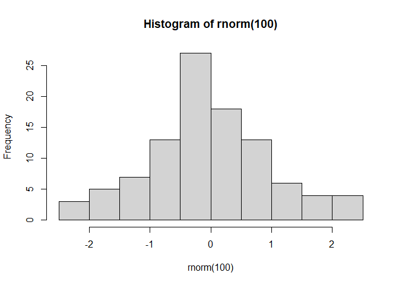
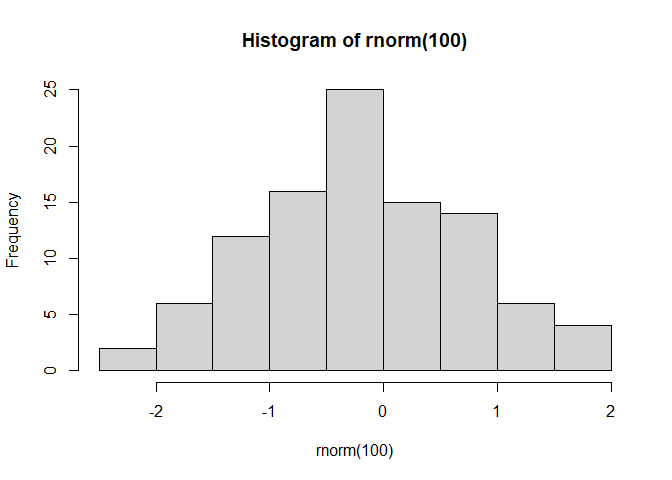
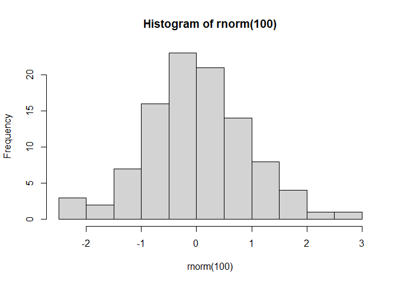

Introducción a R Markdown - GitHub
================
Alarcón González Edgar Gerardo

Usando R Markdown para GitHub
=============================

Este archivo es idéntico al que tiene nombre `R Markdown.Rmd`, la
diferencia es que está especialmente diseñada para **GitHub**. Para
esto, en el preámbulo del documento se agregó lo siguiente:

``` ruby
---
title: "Introducción a R Markdown - GitHub"
author: "Alarcón González Edgar Gerardo"
output: rmarkdown::github_document
---
```

Esto crea un archivo con extensión `.md` que es el formato que va a leer
**GitHub**. Una alternativa es que se creen dos archivos `.html` y uno
`.md`, esto lo puedo lograr con el siguiente cambio en el preámbulo.

``` ruby
---
title: "Introducción a R Markdown - GitHub"
author: "Alarcón González Edgar Gerardo"
output: 
  html_document:
    keep_md: true
---
```

La ventaja que tiene la primera opción es que al compilarlo directamente
en RStudio, se nos mostrará un archivo que es más fiel a como se
observará en la versión final que subiremos a **GitHub**. Adicionalmente
agregaremos la siguiente opción de los `chunk` para almacenar imágenes
que sean creadas en este documento.

``` r
knitr::opts_chunk$set(
  fig.path = "Imágenes_del_Documento/Imágen-"
)
```

Las imágenes las podrán encontrar en donde se encuentra y se haya
compilado el archivo que este archivo que estás leyendo.

Una mala noticia
================

Si se desea escribir una fórmula matemática, para GitHub esto será más
complicado a como se hace normalmente usando simplemente signos $. En
este caso tendremos que usar algo del estilo

``` ruby

```

Esto nos mostrará un resultado como


Pero se debe hacer esto en lugar de simplemente escribir
`$e^{i \pi} = -1$`. Haz clic
[aquí](https://gist.github.com/a-rodin/fef3f543412d6e1ec5b6cf55bf197d7b)
para más información.

**Tristemente, se sugiere simplemente no escribir ecuaciones en un
archivo que se desea publicar en GitHub, aunque esto puede que cambie en
un futuro**.

Aclaración
==========

Lo más recomendado es publicar un archivo, ya sea del tipo `.html` con
RStudio y subirlo a **GitHub** o bien simplemente compilar uno con
extensión `.pdf` y subirlo al repositorio.

Mostramos el resto del documento de forma intacta con la finalidad de ver las posibles diferencias y similitudes
----------------------------------------------------------------------------------------------------------------

¿Cómo ejecutar un archivo R Markdown?
=====================================

Basta con utilizar el comando `CTRL+SHIFT+K`

Comentarios
===========

Para realizar comentarios dentro de **R Markdown** necesitamos escribir
`---` entre la frase o párrafo que queramos comentar, un ejemplo de esto
es lo siguiente:

``` ruby
Esto NO es un comentario.

---
Esto es un comentario.
---
```

Donde el resultado de hacer lo anterior es:

**\_\_\_\_\_\_\_\_\_\_\_\_\_\_\_\_\_\_\_\_\_\_\_\_\_\_\_\_\_\_\_\_\_\_\_\_\_\_\_\_\_\_\_\_\_\_\_\_\_\_\_\_\_\_\_\_\_\_\_\_\_\_\_\_\_\_\_\_\_\_\_\_\_\_\_\_\_\_\_\_\_\_\_\_\_\_\_\_\_\_\_\_\_\_\_\_\_\_\_\_\_\_\_\_\_\_\_\_\_\_\_\_\_\_\_\_\_\_\_\_\_\_\_\_\_\_**

Esto NO es un comentario.

|                        |
|------------------------|
| Esto es un comentario. |

**\_\_\_\_\_\_\_\_\_\_\_\_\_\_\_\_\_\_\_\_\_\_\_\_\_\_\_\_\_\_\_\_\_\_\_\_\_\_\_\_\_\_\_\_\_\_\_\_\_\_\_\_\_\_\_\_\_\_\_\_\_\_\_\_\_\_\_\_\_\_\_\_\_\_\_\_\_\_\_\_\_\_\_\_\_\_\_\_\_\_\_\_\_\_\_\_\_\_\_\_\_\_\_\_\_\_\_\_\_\_\_\_\_\_\_\_\_\_\_\_\_\_\_\_\_\_**

Observando el código de este documento, vemos que tenemos escrito
literalmente lo que está resaltado anteriormente, sin embargo, no se ha
escrito lo que se encuentra entre `---`. De esta manera, podemos
redactar nuestro R Markdown y al mismo tiempo, si queremos realizar un
comentario dentro del mismo que queramos NO aparezca en el documento,
simplemente debemos proceder como se acaba de indicar.

\#Resaltar texto

Hay tres maneras de resaltar texto básicas, **negritas**, *cursiva* y
$\\underline{subrayar}$, para hacer esto, se escribió lo siguiente:

``` ruby
**negritas**
*cursiva*
\underline{subrayar} en pdf
$\underline{subrayar}$ en html
```

También podemos hacer títulos como el de esta sección (resaltar texto)
para eso, utilizamos lo siguiente:

``` ruby
#Resaltar texto
```

Chunk
=====

Imaginemos que esta manera de escribir documentos consta de dos hojas
puesta una encima de otra, la hoja de arriba está escrita en lenguaje
$\\LaTeX$, mientras que la hoja de abajo está escrita en código de R,
nuestro objetivo es redactar un documento que tiene tanto código de
$\\LaTeX$ como código en R, lo cual nos daría como resultado un
documento en el que podemos explicar un trabajo técnico con símbolos
elegantes y al mismo tiempo, con pedazos de código en R ejemplificando o
realizando la tarea que estemos como objetivo, dándonos así un panorama
teórico y práctico de algún ejercicio.

Tengamos en mente la idea de las dos hojas puestas una sobre otra, por
su traducción, *chunk* o, *“cortar un pedazo”*, hacer precisamente eso,
de la hoja que tenemos arriba (la cual corresponde al lenguaje
$\\LaTeX$), vamos a cortar un pedazo, de tal manera que estaríamos
dejando expuesta a la hoja que se encuentra abajo (que corresponde al
lenguaje R), un ejemplo se ve de la siguiente manera:

``` ruby
|```{r}
|1+1
|```
```

Utilizando el chunk anterior dentro del código de manera usual, nos
mostraría lo siguiente:

``` r
1+1
```

    ## [1] 2

Se le puede asignar un Chunk de la siguiente manera:

``` ruby
|```{r NOMBRE}
|1+1
|```
```

Esto dentro del código usual de R Markdown no mostrará algún cambio, sin
embargo, si agregamos el nombre al Chunk, podemos verlo como si fuera
una sección de nuestro documento en un Script de R usual.

Los chunks tienen diferentes opciones, éstas pueden ser consultadas en
la siguiente página de internet: <https://yihui.name/knitr/options/>.
Mostremos algunos ejemplos:

-   echo: Nos permite **mostrar el código** que se escribió para
    realizar una operación.

``` ruby
|```{r NOMBRE, echo = T}
|1+1
|```
```

Nos da como resultado:

``` r
2*10
```

    ## [1] 20

Cambiando el código anterior por *echo = F*, nos arroja el siguiente
resultado:

``` ruby
|```{r NOMBRE, echo = F}
|1+1
|```
```

Nos da como resultado:

    ## [1] 20

-   out.width: Nos permite controlar qué tan grande queremos un gráfico,
    medido en porcentaje.

``` ruby
|```{r , echo = T, out.width='50%'}
|hist(rnorm(100))
|```
```

Nos da como resultado:

``` r
hist(rnorm(100))
```



Cambiando el código anterior por *out.width=‘10%’*, nos arroja el
siguiente resultado:

``` ruby
|```{r , echo = T, out.width='10%'}
|hist(rnorm(100))
|```
```

Nos da como resultado:

``` r
hist(rnorm(100))
```



-   fig.align: Nos permite agregar un gráfico al centro del documento:

``` ruby
|```{r , echo = T, out.width='50%', fig.align='center'}
|hist(rnorm(100))
|```
```

Nos da como resultado:

``` r
hist(rnorm(100))
```



-   eval: Nos permite evaluar o no el código que se está mostrando.

``` ruby
|```{r , echo = T, out.width='50%', fig.align='center', eval=F}
|hist(rnorm(100))
|```
```

Nos da como resultado:

``` r
hist(rnorm(100))
```

Del código anterior, vemos que se muestra el código escrito, mas **no**
se ejecuta y por lo tanto, no muestra el gráfico.

Un detalle importante es que, regresando a la idea original de que
tenemos dos hojas, la de abajo si lo piensan, no está cortada, por lo
que finalmente es un Script de R normal, ¿qué significa esto?, bueno,
significa que si tu haces cosas dentro de un chunk, pueden afectar a los
subsecuentes, tal y como un Script en R, un ejemplo de esto es lo
siguiente:

``` ruby
|```{r}
|x<-10
|```
|```{r}
|x+1
|```
```

Nos da como resultado:

``` r
x<-10
```

``` r
x+1
```

    ## [1] 11

Es aquí donde debemos tener cuidado con las opciones de los Chunk,
realizando cosas como lo siguiente:

``` ruby
|```{r, eval = F}
|y<-10
|```
|```{r}
|y+1
|```
```

Lo cual no nos permitiría correr el código pues no existe la variable
`y` ya que nunca se ejecutó esa parte del código.

Lenguaje matemático
===================

Para escribir algo en lenguaje matemático se necesita usar el signo
**$**; hay dos manera de escribir en lenguaje matemático, por renglón o
en un *display*. La diferencia entre éstos la mostraremos con el
siguiente ejemplo:

-   Renglón

``` ruby
Como se escribe: $\int_0^1 x dx= \frac{1}{2} = 0.5$
```

Como se ve: $\\int\_0^1 x dx= \\frac{1}{2} = 0.5$

-   Display

``` ruby
Como se escribe:

$$\sum_{i=1}^n i= \frac{n(n+1)}{2}$$
```

Como se ve:

$$\\sum\_{i=1}^n i= \\frac{n(n+1)}{2}$$

Claramente, lo anterior requiere de ciertos conocimientos en $\\LaTeX$,
pero desafortunadamente no los vamos a revisar a fondo.

Imágenes
========

Usualmente es necesario agregar imágenes (fotos) a ciertos documentos,
para hacer esto el procedimiento es sencillo, vamos a requerir la
librería `knitr` y que la imagen que vamos a agregar se encuentre
exactamente donde se encuentra nuestro archivo `.RMD`, posteriormente,
basta con ejecutar el siguiente código:

``` r
library(knitr) 
include_graphics("imagen.PNG")
```


Tablas
======

El lenguaje $\\LaTeX$ tiene su manera de escribir las tablas, sin
embargo, la librería `knitr` tiene un código para que no tengamos que
escribir a mano una tabla en $\\LaTeX$, basta con realizar lo siguiente
para mostrar una tabla en éste lenguaje.

``` r
kable(head(iris))
```

| Sepal.Length | Sepal.Width | Petal.Length | Petal.Width | Species |
|-------------:|------------:|-------------:|------------:|:--------|
|          5.1 |         3.5 |          1.4 |         0.2 | setosa  |
|          4.9 |         3.0 |          1.4 |         0.2 | setosa  |
|          4.7 |         3.2 |          1.3 |         0.2 | setosa  |
|          4.6 |         3.1 |          1.5 |         0.2 | setosa  |
|          5.0 |         3.6 |          1.4 |         0.2 | setosa  |
|          5.4 |         3.9 |          1.7 |         0.4 | setosa  |

-   kable: Es la función que nos permite visualizar la tabla de esta
    manera.

-   head: Es la función que toma solo la primera parte de la base de
    datos.

-   iris: Es una base de datos precargada ya en R.

Reglas
======

Para correr un código en R Markdown es necesario que se cumpla lo
siguiente:

1.  TODO el código debe funcionar correctamente, si alguna parte, ya sea
    del $\\LaTeX$ o del Script de R no funciona, el código no correrá y
    por lo tanto, el archivo no se generará.

2.  No se pueden utilizar funciones que requieran una manipulación
    intermedia del usuario para concluir su ejecución, esto incluye
    funciones como `View`, `identify`, `help`, gráficos en 3D, etc.

3.  Todo chunk debe estar abierto y cerrado correctamente.

4.  Ningún chunk puede repetir el nombre.

5.  Habrá ocasiones (raras) en que el Script funcione normalmente pero
    para el R Markdown sea necesario instalar una librería nueva, hágalo
    y luego ejecute su código con normalidad.

6.  El título del documento Markdown no puede tener caracteres en
    español ni caracteres reservados para nombrar un documento.
